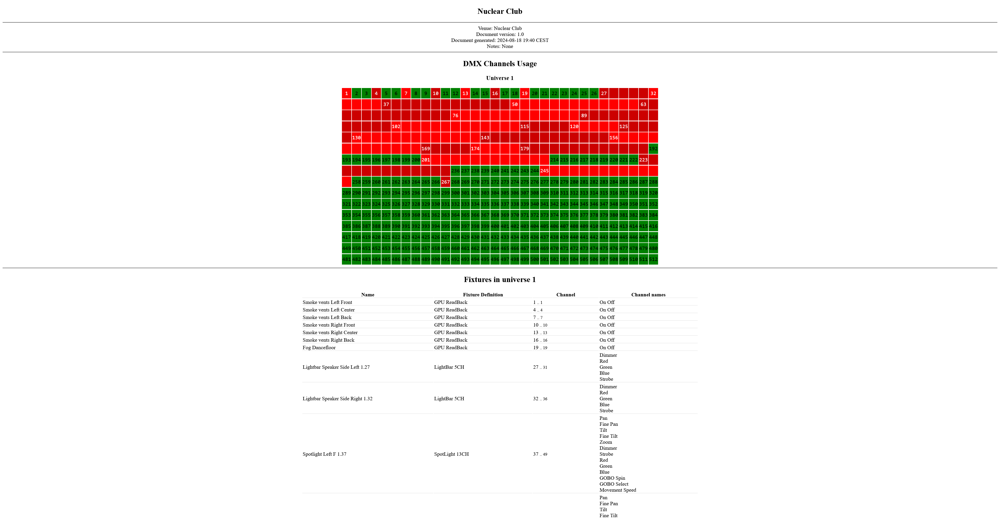

# VRSL DMX To HTML

In Unity:
- VRSL -> Export -> To JSON

Then:
- Copy the json file where the python script is
- Copy the `example.yml` to whatever you want
- run the script: `python3 gen.py --html "./the json file.json" ./your_file.yml output.html`

That's it.

Screenshot of generated html:

